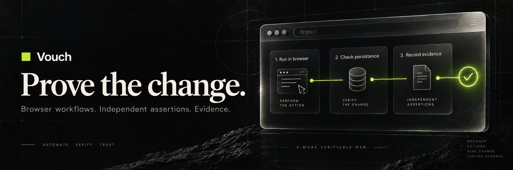
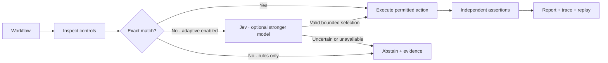

<p align="center">
  
</p>

<h1 align="center">Vouch</h1>
<p align="center"><strong>Your agent builds. Vouch verifies.</strong></p>
<p align="center">Run local browser workflows, check application state, and bring actionable evidence back to the agent.</p>

<p align="center">
  <a href="https://github.com/hamza-paracha/vouch/actions/workflows/ci.yml"></a>
  <a href="LICENSE"></a>
  <a href="https://github.com/hamza-paracha/vouch/releases"></a>
  
</p>

<p align="center">
  <a href="#try-it-in-two-minutes">Quickstart</a> ·
  <a href="docs/verification.md">Documentation</a> ·
  <a href="docs/validation.md">Validation</a> ·
  <a href="https://github.com/hamza-paracha/vouch/releases">Releases</a> ·
  <a href="CONTRIBUTING.md">Contribute</a>
</p>

## A success toast is only half the story

Your agent edits a form. The browser says **“Saved.”** But did the server persist the change?

Vouch runs the interaction and checks the outcome through explicit assertions. A separate read of application state can catch a missing write even when the interface reports success. The agent gets the failing assertion, action history, and a replayable workflow to investigate, fix, and verify again.

```text
Browser interaction         Independent state check        Result
───────────────────         ───────────────────────        ──────
Fill name → Save → “Saved”   GET profile → “Original”        FAIL
Fix the persistence write
Fill name → Save → “Saved”   GET profile → “Ada Lovelace”    PASS
```

This is the regression we reproduced and repaired through the installed MCP runtime. [Read the measured evidence →](docs/validation.md#source-level-reproduce--fix--verify)

## Where it helps

| When you need to… | Vouch provides… |
| --- | --- |
| Check an agent’s local app change | Real Chromium interactions followed by explicit assertions |
| Reproduce a misleading success message | A separate same-origin JSON read to check the expected state |
| Give an agent enough context to fix a failure | Structured reports, failing observations, action records, and a replay file |
| Connect verification to your coding workflow | Two MCP tools, a CLI, and local plugin bundles for Codex and Claude Code |
| Handle a control label that differs from the intent | Optional Jev selection, with an explicitly enabled stronger-model fallback |
| Keep routine verification predictable | Models off by default, origin/write restrictions, deadlines, and persistent paid-call limits |

## Try it in two minutes

Requires **Node.js 22+**, npm, and Playwright Chromium. No API key or model service is needed.

```sh
git clone https://github.com/hamza-paracha/vouch.git
cd vouch
npm ci
npx playwright install chromium
npm run verify -- --doctor
npm run verify:demo
```

On Linux, use `npx playwright install --with-deps chromium` to install browser system dependencies too.

The demo starts two local apps and cleans them up automatically. Expected results:

```text
false-success-toast  → failed   (success message, missing state change)
persisted-write      → passed   (success message and expected state)
model calls          → 0
```

The demo command exits successfully only when both expected outcomes are observed. For the separate disk-backed example, run `npm run verify:example`; it checks both the MCP result and the on-disk profile.

## Use it from your coding agent

Register the stdio server using the **absolute path** to your checkout:

```sh
# Codex
codex mcp add vouch -- node /absolute/path/to/vouch/bin/vouch.mjs --stdio

# Claude Code — run from your application project
claude mcp add --transport stdio vouch -- node /absolute/path/to/vouch/bin/vouch.mjs --stdio
```

Start a new task/session, then ask:

> Use Vouch to inspect my disposable local app at http://127.0.0.1:3000. Verify the profile-saving flow, including the persisted display name through the app’s read endpoint. Read the evidence, fix any reproduced failure, and rerun the same assertions. Keep paid models disabled.

| Tool | Purpose |
| --- | --- |
| `inspect_page` | Discover accessible controls without allowing HTTP writes or calling models |
| `verify_workflow` | Run a bounded workflow and return status, assertions, routing, and evidence paths |

For the bundled workflow skill and native plugin manifests, use `npm run plugin:build`. [Client setup and local plugin installation →](docs/verification.md#native-plugin-and-installation-checks)

## Describe the outcome, then verify it

Workflows are small JSON files. This example matches the included profile app; change its URL and assertions to match your own application.

```json
{
  "url": "http://127.0.0.1:4178/settings",
  "policy": "rules",
  "confirmDisposable": true,
  "allowedWritePaths": ["/api/profile"],
  "steps": [
    { "kind": "fill", "target": { "role": "textbox", "name": "Display name" }, "value": "Ada Lovelace" },
    { "kind": "choose", "intent": "Save profile" },
    { "kind": "assertText", "text": "Profile saved" },
    { "kind": "assertJson", "path": "/api/profile", "field": ["displayName"], "equals": "Ada Lovelace" }
  ]
}
```

To run this exact example, start `node examples/profile-app/server.mjs` in another terminal, save the JSON as `workflow.json`, then run:

```sh
npm run verify -- ./workflow.json
```

`assertJson` makes an independent GET using the browser context’s cookies. Its evidence is only as authoritative as that endpoint: a cached or optimistic read does not prove durable storage. The example app reads its persisted file.

## How it works



Models can propose a control; they do not decide whether an assertion passed. Paid routing requires both an adaptive workflow and operator-configured limits. Reservations are persisted before calls, shared across the two model tiers, and retained after timeouts or failures. A configured dollar reservation is an estimate, not a guaranteed provider billing cap. [Routing and spending details →](docs/verification.md#routing-and-spending)

Each run saves three local artifacts:

| Artifact | What you get |
| --- | --- |
| `report.json` | Outcome, assertion results, findings, model usage, limits, and source fingerprint |
| `trace.jsonl` | Structured actions and bounded accessibility observations |
| `workflow.json` | Replay input with completed choices frozen and models disabled |

The CLI exits `0` on a pass, `1` on a non-passing run, and `2` on invalid input or startup failure. Replays require the same initial application state. The trace is structured JSON, not a video or Playwright trace ZIP.

## Tested, with clear boundaries

**This is an alpha for controlled local HTTP applications.** It supports literal loopback addresses with an explicit port, exact-origin requests, and explicitly allowed write paths. Use disposable data and a production preview for apps whose development servers require HMR sockets.

- **Automated:** routing, assertions, network/write restrictions, redirects, cancellation, persistent budgets, redaction, and real MCP transport; plus clean-package installation checks.
- **Live Jev smoke:** three requests covering semantic selection, a false-success regression, and abstention. This establishes those cases, not general accuracy.
- **Actual repair:** reproduced a missing persistence write through the installed runtime, fixed the source, and confirmed the result with an independent disk read.
- **Clients:** Codex plugin installation and Claude Code plugin/MCP loading checked locally.

HTTPS, remote targets, imported login sessions, WebSocket-dependent flows, popups, and visual assertions are not supported. OpenRouter escalation is tested with simulated responses only. A passing workflow covers its explicit assertions and observed browser checks; it does not certify an entire application. [Full results and limitations →](docs/validation.md)

## Development

```sh
npm run typecheck
npm test
npm run verify:install
npm run verify:example
```

CI runs without provider credentials. See [CONTRIBUTING.md](CONTRIBUTING.md), [SECURITY.md](SECURITY.md), and the [changelog](CHANGELOG.md).

## Built on open source

Vouch builds on Lucas Dow’s [browser-jev](https://github.com/DowLucas/browser-jev), with its original explorer and runner preserved. Their commands and model defaults are documented separately in the [upstream explorer guide](docs/upstream-explorer.md). Verification uses [Playwright](https://playwright.dev/), [MCP](https://modelcontextprotocol.io/), and optional [Jev](https://docs.typesafe.ai/).

[MIT licensed](LICENSE). Original copyright and attribution are retained. Codex and Claude Code are supported integrations; this project is independently maintained.
