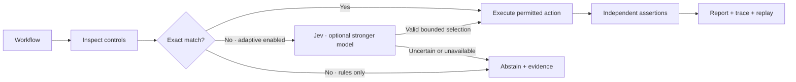

<h1 align="center">vouch-jev</h1>
<p align="center"><strong>Code review powered by Jev. Verified with evidence.</strong></p>
<p align="center">vouch-jev uses Jev to review code changes, surface risks, and guide browser decisions. Challenge the findings with mutation tests and real browser assertions.</p>

<p align="center">
  <a href="https://github.com/hamza-paracha/vouch/actions/workflows/ci.yml"></a>
  <a href="LICENSE"></a>
  <a href="https://github.com/hamza-paracha/vouch/releases"></a>
  
</p>

<p align="center">
  <a href="#try-it-in-two-minutes">Quickstart</a> ·
  <a href="docs/verification.md">Documentation</a> ·
  <a href="docs/validation.md">Validation</a> ·
  <a href="https://github.com/hamza-paracha/vouch/releases">Releases</a> ·
  <a href="CONTRIBUTING.md">Contribute</a>
</p>

## Review the diff with structured Jev judgments

vouch-jev exposes `review_change`, `assess_pr`, and `check_file`. Jev evaluates each changed file for breaking behavior, risk, missing tests, error handling, input validation, side effects and merge readiness. Reports preserve probabilities, warnings, uncertainty and incomplete context. These judgments complement executable browser and mutation evidence.

Use the standalone `vouch-jev-guard` entry point for code review without Chromium, or all seven tools through the vouch-jev MCP server. Paid review requires explicit provider and persistent-budget configuration. A ten-file synthetic review measured **638 ms** in a real-provider check; this is a smoke measurement, not an accuracy claim or latency guarantee.

[Setup, verdict semantics and examples →](docs/structured-review.md)

## A success toast is only half the story

Your agent edits a form. The browser says **“Saved.”** But did the server persist the change?

vouch-jev runs the interaction and checks the outcome through explicit assertions. A separate read of application state can catch a missing write even when the interface reports success. The agent gets the failing assertion, action history, and a replayable workflow to investigate, fix, and verify again.

```text
Browser interaction         Independent state check        Result
───────────────────         ───────────────────────        ──────
Fill name → Save → “Saved”   GET profile → “Original”        FAIL
Fix the persistence write
Fill name → Save → “Saved”   GET profile → “Ada Lovelace”    PASS
```

This is the regression we reproduced and repaired through the installed MCP runtime. [Read the measured evidence →](docs/validation.md#source-level-reproduce--fix--verify)

## Challenge the tests behind the change

A green test suite can still miss the bug. vouch-jev now reads your Git diff, identifies changed JavaScript/TypeScript functions and affected tests, then introduces small deliberate faults in disposable copies: an off-by-one boundary, a missing validation guard, a reversed condition.

If the tests still pass, vouch-jev returns the exact surviving patch and a focused regression-test suggestion. Baselines run twice, failing mutants are repeated, and the original checkout stays untouched by the mutation engine. No model API call is required.

```sh
npm run verify:change-demo
```

The demo starts with passing but weak tests, finds surviving mutations, adds explicit boundary/error assertions, and verifies that those tests now detect the same mutations. It demonstrates test sensitivity, not automatic proof of correctness.

Use `vouch-jev analyze --project /path/to/repo --base HEAD` for read-only analysis. Execution requires a project configuration and `--allow-exec`. [Code-aware verification →](docs/code-verification.md) · [Implementation roadmap →](docs/roadmap.md)

## Where it helps

| When you need to… | vouch-jev provides… |
| --- | --- |
| Review a code change with Jev | File-level judgments for risk, missing tests and merge readiness, with probabilities and uncertainty |
| Find tests that miss a changed behavior | Diff-aware mutation runs with exact surviving patches |
| Check an agent’s local app change | Real Chromium interactions followed by explicit assertions |
| Reproduce a misleading success message | A separate same-origin JSON read to check the expected state |
| Give an agent enough context to fix a failure | Structured reports, failing observations, action records, and a replay file |
| Connect verification to your coding workflow | Seven MCP tools, a CLI, and local plugin bundles for Codex and Claude Code |
| Handle a control label that differs from the intent | Optional Jev selection, with an explicitly enabled stronger-model fallback |
| Keep routine verification predictable | Models off by default, origin/write restrictions, deadlines, and persistent paid-call limits |

## Try it in two minutes

Requires **Node.js 22+**, npm, Git for code analysis, and Playwright Chromium for browser workflows. The browser demo below needs no API key or model service. Jev code review requires a TypeSafe API key and explicit model budgets; follow the [review setup](docs/structured-review.md#install-and-connect).

```sh
git clone https://github.com/hamza-paracha/vouch.git
cd vouch
npm ci
npx playwright install chromium
npm run verify -- --doctor
npm run verify:demo
```

On Linux, use `npx playwright install --with-deps chromium` to install browser system dependencies too.

The demo starts two local apps and cleans them up automatically. Expected results:

```text
false-success-toast  → failed   (success message, missing state change)
persisted-write      → passed   (success message and expected state)
model calls          → 0
```

The demo command exits successfully only when both expected outcomes are observed. For the separate disk-backed example, run `npm run verify:example`; it checks both the MCP result and the on-disk profile.

The product and package are named `vouch-jev`; the source repository remains `hamza-paracha/vouch`. After `npm link`, use `vouch-jev` or `vouch-jev-guard`. Existing `vouch` and `vouch-guard` commands, `vouch.config.json`, and environment variables remain supported.

## Use it from your coding agent

Register the stdio server using the **absolute path** to your checkout:

```sh
# Codex
codex mcp add vouch-jev -- node /absolute/path/to/vouch/bin/vouch.mjs --stdio

# Claude Code — run from your application project
claude mcp add --transport stdio vouch-jev -- node /absolute/path/to/vouch/bin/vouch.mjs --stdio
```

Start a new task/session, then ask:

> Use vouch-jev to inspect my disposable local app at http://127.0.0.1:3000. Verify the profile-saving flow, including the persisted display name through the app’s read endpoint. Read the evidence, fix any reproduced failure, and rerun the same assertions. Keep paid models disabled.

| Tool | Purpose |
| --- | --- |
| `review_change` | Jev review of changed files with structured verdicts and uncertainty |
| `assess_pr` | File-level review plus PR scope, split, security and urgency assessment |
| `check_file` | One changed file, one bounded model request |
| `analyze_change` | Inspect the configured repository diff, affected tests and mutation candidates |
| `verify_change` | Execute configured tests and challenge them with bounded mutations in disposable copies |
| `inspect_page` | Discover accessible controls without allowing HTTP writes or calling models |
| `verify_workflow` | Run a bounded workflow and return status, assertions, routing, and evidence paths |

For the bundled workflow skill and native plugin manifests, use `npm run plugin:build`. [Client setup and local plugin installation →](docs/verification.md#native-plugin-and-installation-checks)

## Describe the outcome, then verify it

Workflows are small JSON files. This example matches the included profile app; change its URL and assertions to match your own application.

```json
{
  "url": "http://127.0.0.1:4178/settings",
  "policy": "rules",
  "confirmDisposable": true,
  "allowedWritePaths": ["/api/profile"],
  "steps": [
    { "kind": "fill", "target": { "role": "textbox", "name": "Display name" }, "value": "Ada Lovelace" },
    { "kind": "choose", "intent": "Save profile" },
    { "kind": "assertText", "text": "Profile saved" },
    { "kind": "assertJson", "path": "/api/profile", "field": ["displayName"], "equals": "Ada Lovelace" }
  ]
}
```

To run this exact example, start `node examples/profile-app/server.mjs` in another terminal, save the JSON as `workflow.json`, then run:

```sh
npm run verify -- ./workflow.json
```

`assertJson` makes an independent GET using the browser context’s cookies. Its evidence is only as authoritative as that endpoint: a cached or optimistic read does not prove durable storage. The example app reads its persisted file.

## How it works



Models can propose a control; they do not decide whether an assertion passed. Paid routing requires both an adaptive workflow and operator-configured limits. Reservations are persisted before calls, shared across the two model tiers, and retained after timeouts or failures. A configured dollar reservation is an estimate, not a guaranteed provider billing cap. [Routing and spending details →](docs/verification.md#routing-and-spending)

Each browser run saves three local artifacts:

| Artifact | What you get |
| --- | --- |
| `report.json` | Outcome, assertion results, findings, model usage, limits, and source fingerprint |
| `trace.jsonl` | Structured actions and bounded accessibility observations |
| `workflow.json` | Replay input with completed choices frozen and models disabled |

The CLI exits `0` on a pass, `1` on a non-passing run, and `2` on invalid input or startup failure. Replays require the same initial application state. The trace is structured JSON, not a video or Playwright trace ZIP.

## Tested, with clear boundaries

**This is an alpha for controlled local HTTP(S) applications and trusted JavaScript/TypeScript repositories.** It supports literal loopback addresses with an explicit port, exact-origin requests, and explicitly allowed write paths. Use disposable data and a production preview for apps whose development servers require HMR sockets.

- **Code verification:** the controlled demo exposes three surviving mutations, then detects all three after targeted boundary and error assertions are added.
- **Automated:** routing, assertions, network/write restrictions, redirects, cancellation, persistent budgets, redaction, and real MCP transport; plus clean-package installation checks.
- **Live Jev smoke:** three requests covering semantic selection, a false-success regression, and abstention. This establishes those cases, not general accuracy.
- **Actual repair:** reproduced a missing persistence write through the installed runtime, fixed the source, and confirmed the result with an independent disk read.
- **Clients:** Codex plugin installation and Claude Code plugin/MCP loading checked locally.

HTTPS and named cookie/localStorage sessions are supported. Remote targets, cross-origin login flows, WebSocket-dependent flows, popups, and visual assertions remain unsupported. OpenRouter escalation is tested with simulated responses only. A passing workflow covers its explicit assertions and observed browser checks; it does not certify an entire application. [Full results and limitations →](docs/validation.md)

## Development

```sh
npm run typecheck
npm test
npm run verify:change-demo
npm run verify:install
npm run verify:example
```

CI runs without provider credentials. See [CONTRIBUTING.md](CONTRIBUTING.md), [SECURITY.md](SECURITY.md), and the [changelog](CHANGELOG.md).

## License

[MIT licensed](LICENSE). Verification uses [Playwright](https://playwright.dev/), [MCP](https://modelcontextprotocol.io/), and [Jev](https://docs.typesafe.ai/). Codex and Claude Code are supported integrations.
